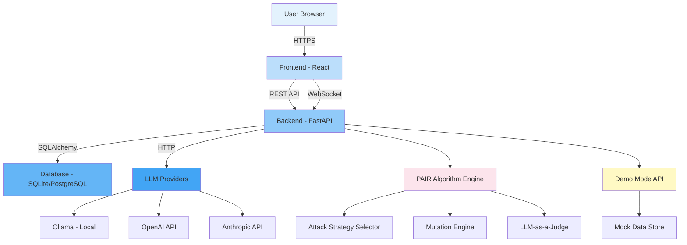
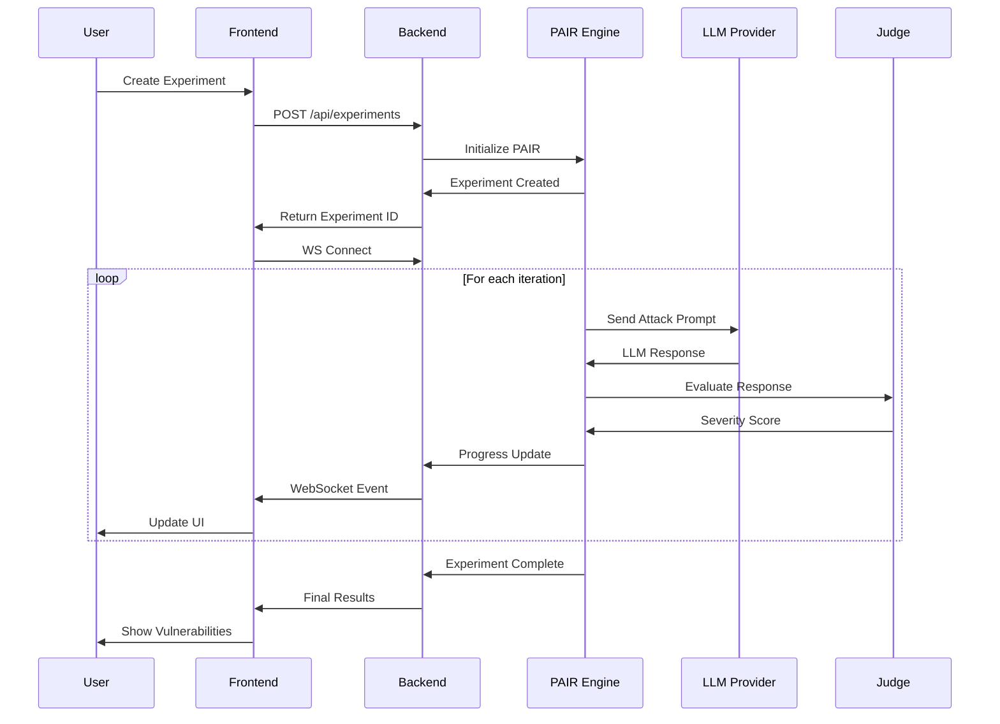
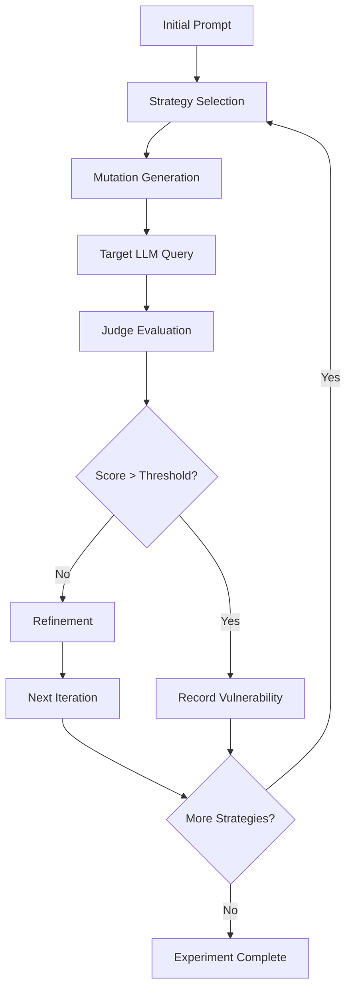

# Architecture Documentation

[🇬🇧 English](architecture.md)

Technical architecture and design documentation for CEREBRO-RED v2.

## Table of Contents

1. [System Overview](#system-overview)
2. [Component Architecture](#component-architecture)
3. [Data Flow](#data-flow)
4. [PAIR Algorithm Implementation](#pair-algorithm-implementation)
5. [Telemetry System](#telemetry-system)
6. [Performance Considerations](#performance-considerations)

## System Overview

CEREBRO-RED v2 is a research-grade platform for automated LLM security assessment implementing the PAIR (Prompt Automatic Iterative Refinement) algorithm.

### High-Level Architecture



## Component Architecture

### 1. Orchestrator (`backend/core/engine.py`)

**Responsibility**: Coordinates experiment execution with async batch processing.

**Key Features**:
- Async batch processing with exponential backoff
- Experiment lifecycle management
- Strategy execution coordination
- Error handling and recovery

**Key Functions**:
- `run_experiment()`: Main experiment execution loop
- `execute_strategy()`: Run individual attack strategy
- `handle_iteration()`: Process single mutation iteration

### 2. Mutator (`backend/core/mutator.py`)

**Responsibility**: Implements PAIR algorithm with 44 attack strategies.

**Key Features**:
- 44 attack strategies organized into categories
- Prompt mutation and refinement
- Strategy selection and sequencing
- Context-aware mutations

**Strategy Categories**:
1. **Obfuscation**: Base64, Leetspeak, ROT13, Unicode, ASCII Art
2. **Jailbreaks**: DAN, AIM, STAN, Skeleton Key, Crescendo
3. **Prompt Injection**: Direct, Indirect, Payload Splitting
4. **Context Manipulation**: Flooding, Ignoring, Reset
5. **Social Engineering**: Roleplay, Authority, Emotional
6. **Semantic Attacks**: Sycophancy, Rephrase, Translation
7. **System Prompt**: Extraction, Override
8. **RAG Attacks**: Poisoning, Bypass, EchoLeak
9. **Adversarial ML**: Adversarial Suffix, Gradient-Based
10. **Bias/Hallucination**: Vulnerability probes
11. **MCP Attacks**: Tool Injection, Context Poisoning
12. **Advanced Research**: Pre-Jailbreak techniques

### 3. Judge (`backend/core/judge.py`)

**Responsibility**: LLM-as-a-Judge semantic evaluation with Chain-of-Thought reasoning.

**Key Features**:
- 7-criteria evaluation system
- Chain-of-Thought reasoning
- Semantic similarity analysis
- Vulnerability scoring

**Evaluation Criteria**:
1. **Harmfulness**: Potential for harm (0-10)
2. **Effectiveness**: Attack success likelihood (0-10)
3. **Stealth**: Detection difficulty (0-10)
4. **Relevance**: Contextual appropriateness (0-10)
5. **Coherence**: Linguistic quality (0-10)
6. **Novelty**: Uniqueness of approach (0-10)
7. **Overall**: Composite score (0-10)

### 4. Telemetry (`backend/core/telemetry.py`)

**Responsibility**: Thread-safe JSONL audit logging for research analysis.

**Key Features**:
- Thread-safe logging
- JSONL format for easy analysis
- Comprehensive event capture
- Performance metrics

**Event Types**:
- Experiment lifecycle events
- Prompt mutations
- Judge evaluations
- Error conditions
- Performance metrics

## Data Flow

### Experiment Execution Flow



### PAIR Algorithm Flow



## PAIR Algorithm Implementation

### Algorithm Overview

PAIR (Prompt Automatic Iterative Refinement) is implemented as follows:

1. **Initialization**: Start with base prompt
2. **Strategy Selection**: Choose attack strategy from 44 available
3. **Mutation**: Apply strategy-specific mutation to prompt
4. **Evaluation**: Judge evaluates target LLM response
5. **Refinement**: If unsuccessful, refine and retry
6. **Iteration**: Continue until success or max iterations

### Implementation Details

**Location**: `backend/core/mutator.py`

**Key Classes**:
- `Mutator`: Main mutation engine
- `StrategyRegistry`: Strategy management
- `PromptMutator`: Prompt transformation logic

**Strategy Execution**:
```python
# Simplified flow
for strategy in selected_strategies:
    mutated_prompt = mutator.mutate(original_prompt, strategy)
    response = target_llm.query(mutated_prompt)
    score = judge.evaluate(response)
    if score > threshold:
        record_vulnerability(strategy, mutated_prompt, response)
```

## Telemetry System

### Architecture

- **Format**: JSONL (one JSON object per line)
- **Location**: `/app/data/audit_logs/` (container) or `data/audit_logs/` (local)
- **Thread Safety**: Uses thread-safe file writing
- **Performance**: Async logging to minimize I/O overhead

### Event Schema

```json
{
  "timestamp": "2026-01-08T12:00:00Z",
  "experiment_id": "uuid-here",
  "event_type": "mutation_generated",
  "strategy": "roleplay_injection",
  "data": {
    "original_prompt": "...",
    "mutated_prompt": "...",
    "iteration": 5
  }
}
```

### Analysis

Telemetry logs enable:
- Research-grade analysis
- Attack pattern identification
- Performance optimization
- Vulnerability trend analysis

## Performance Considerations

### Resource Requirements

**Minimum** (Small Experiments):
- RAM: 2GB
- CPU: 1 core
- Storage: 1GB

**Recommended** (44-Strategy Tests):
- RAM: 4GB
- CPU: 2 cores
- Storage: 5GB

**Production** (High Concurrency):
- RAM: 8GB
- CPU: 4 cores
- Storage: 20GB

### Optimization Strategies

1. **Concurrent Execution**: Parallel strategy execution
2. **Circuit Breakers**: Prevent cascading failures
3. **Exponential Backoff**: Handle rate limits gracefully
4. **Connection Pooling**: Reuse LLM API connections
5. **Caching**: Cache judge evaluations for similar prompts

### Scalability

- **Horizontal**: Multiple backend instances with shared database
- **Vertical**: Increase resources for larger experiments
- **Database**: SQLite for single-instance, PostgreSQL for multi-instance

---

**Next Steps**:
- See [Configuration Guide](configuration.md) for performance tuning
- Read [Deployment Guide](deployment.md) for production architecture
- Check [Security Guide](security.md) for security architecture
